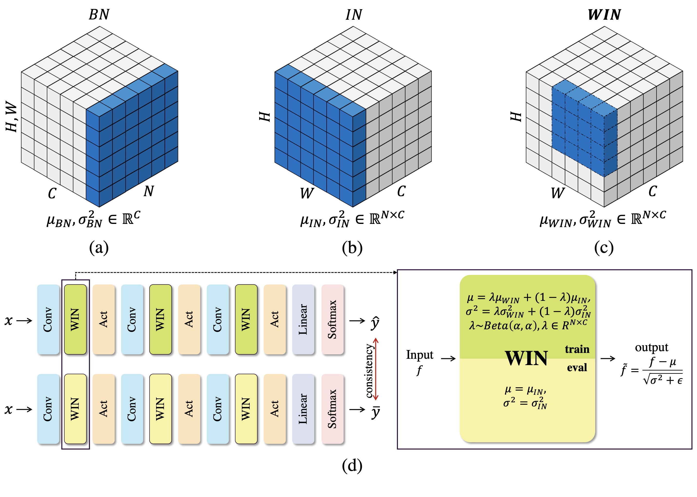

# A simple normalization technique using window statistics to improve the out-of-distribution generalization in medical images




## Introduction

Since the data scarcity and the data heterogeneity are prevailing for medical images, well-trained Convolutional Neural Networks (CNNs) with previous normalization methods may plummet in performance when deploying it to a new site. On the other hand, a reliable model for real-world applications should generalize well both on in-distribution (IND) data and out-of-distribution (OOD) data (e.g., the new site data). In this paper, we present a novel normalization technique named window normalization (WIN), which is a simple yet effective alternative to existing normalization methods. Specifically, WIN perturbs the normalizing statistics with the local statistics computed on a window of features. This feature-level augmentation technique regularizes the models well and improves their OOD generalization significantly. Taking its advantage, we propose a novel self-distillation method, named WIN-WIN to further improve the OOD generalization in classification. WIN-WIN is easily implemented with twice forward passes and a consistency constraint, which can be a simple extension for existing methods.

<!--Read the paper [here](https://arxiv.org/pdf/2112.05135.pdf).-->

## Precomputed windows 
The precomputed windows may be enabled for faster training by setting the flag `--WIN-WIN offline`.

They are available [here](https://drive.google.com/file/d/1s2eI1jeJoWDxh7QAfSADs_5FvYTStH06/view?usp=sharing).

## Requirements

*   numpy==1.19.5
*   Pillow==8.3.2
*   torch==1.10.0
*   torchvision==0.11.1


## CIFAR-10-C and CIFAR-100-C
Download CIFAR-10-C and CIFAR-100-C datasets with:
```
mkdir -p ./data/cifar
curl -O https://zenodo.org/record/2535967/files/CIFAR-10-C.tar
curl -O https://zenodo.org/record/3555552/files/CIFAR-100-C.tar
tar -xvf CIFAR-100-C.tar -C data/cifar/
tar -xvf CIFAR-10-C.tar -C data/cifar/
```

## Usage

Training recipes used in our paper:
  ```
  python cifar.py \
    --dataset cifar10 \
    --epochs 180 \
    --lr 0.3 \
    --batch-size 64 \
    --WIN-WIN online \
  ```

  ```
  python cifar.py \
    --dataset cifar100 \
    --epochs 200 \
    --lr 0.3 \
    --batch-size 64 \
    --WIN-WIN online \
  ```

### Results on CIFAR

Normalization | CIFAR-10 (Acc.) | CIFAR-10-C (mCE) | CIFAR-100 (Acc. )  | CIFAR-100-C (mCE)
-------|:-------:|:--------:|:--------:|:--------:|
BatchNorm    |**95.6** |23.5     |75.3     |50.6
InstanceNorm |94.6     |18.5     |75.1     |48.4
WindowNorm   |94.2     |19.1     |75.2     |46.4
WIN-WIN      |94.6     |**17.5** |**76.4** |**45.7**

## Pretrained Models
Weights for a ResNet-18 CIFAR-10 classifier trained with WIN-WIN for 180 epochs are available
[here](https://drive.google.com/file/d/1ssTOHAybx5D09yOzFZiAEwjP4MfVEFkS/view?usp=sharing).

Weights for a ResNet-18 CIFAR-100 classifier trained with WIN-WIN for 200 epochs are available
[here](https://drive.google.com/file/d/1-4IZ9TI4w65tUZkJjUUQ3BjRQS2Z07R0/view?usp=sharing).

## Contact
joe1chief1993 at gmail.com   
Any discussions, suggestions and questions are welcome!
